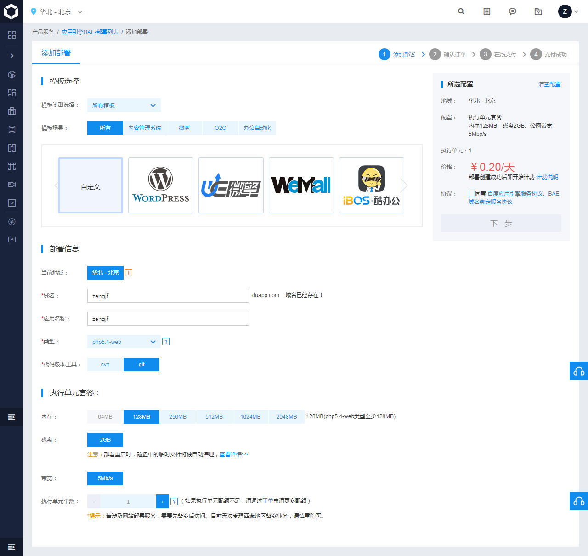
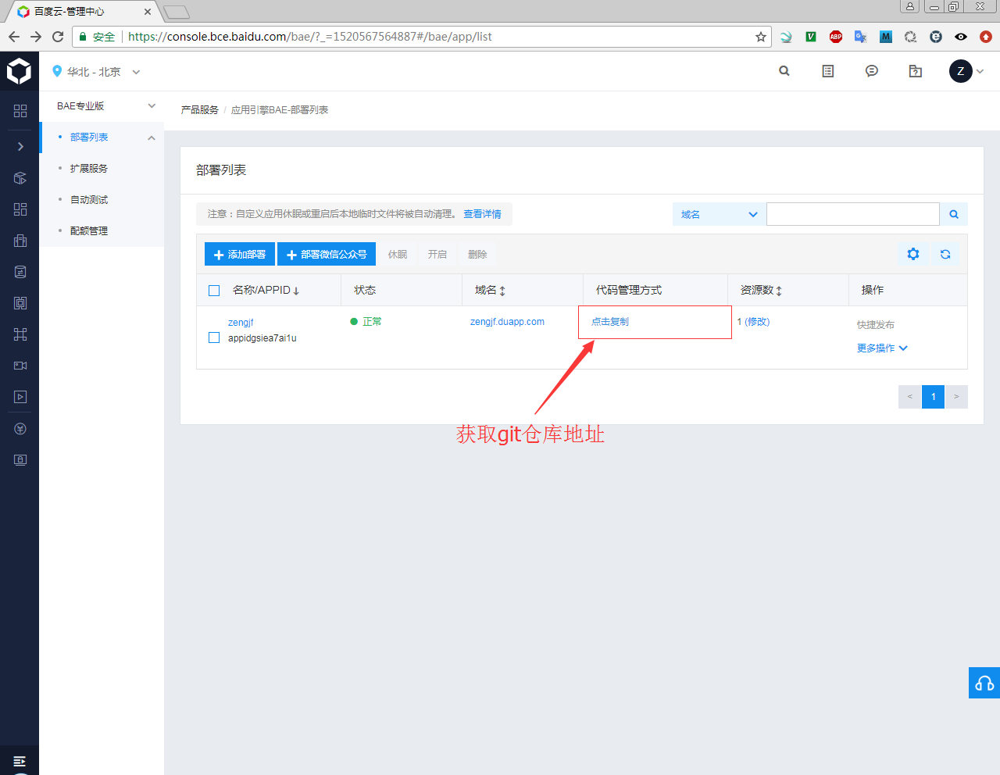

# Get BAE PHP Server

## Config for BAE PHP Server

## Get Git Repository URL

* Git Repository: `https://git.duapp.com/appidgsiea7ai1u`
* 该Web服务器默认是支持HTTPS的；
* 这里是Git仓库，本身就是git，所以需要先pull，在这个基础上进行修改；
* 推送完成，不会自动发布，需要手动去点击发布才行。

