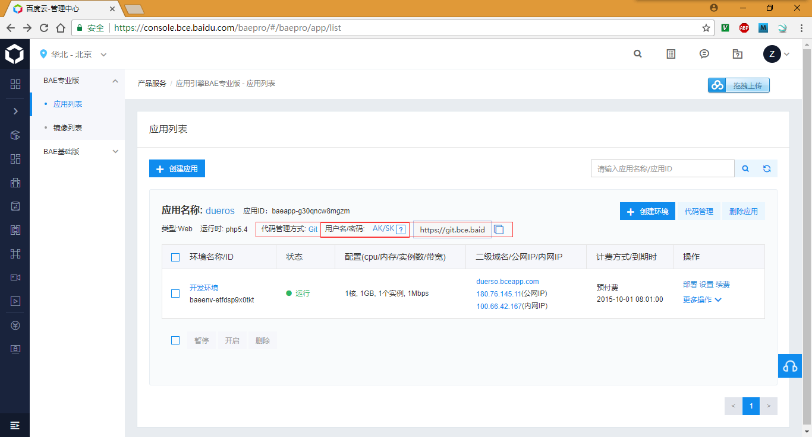
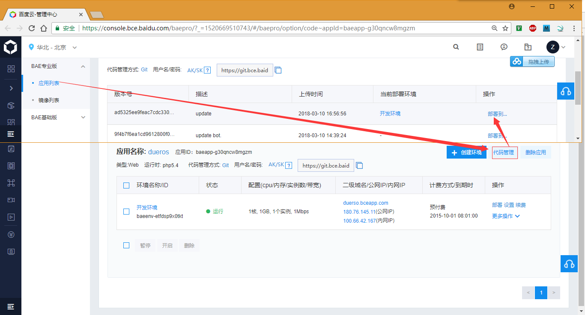

# BAE Username Password Deploy

## Git 操作

* 百度的BAE普通版本使用**百度的账户、密码**push就行了；
* 在进行操作的时候，最好先clone或者pull一次，否则可能存在push不上的问题；
* 百度的BAE专业版需要使用**AK/SK**作为账户名、密码进行push；  
  
  * ak: 5c5b5ea289ed4c6db75c131e7eaf5715	
  * sk: ca49ed4d426541e79f7da83fde4b9e28

## Deploy

代码管理中会显示每次的commit对应的版本，可以针对行的部署。

