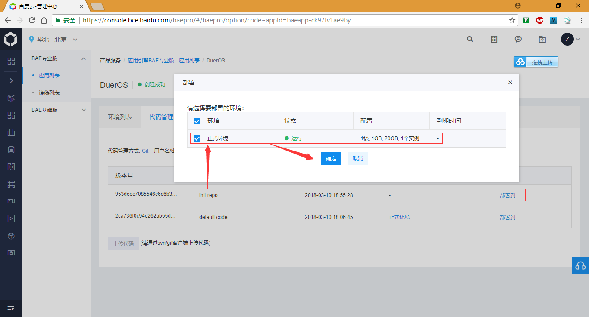
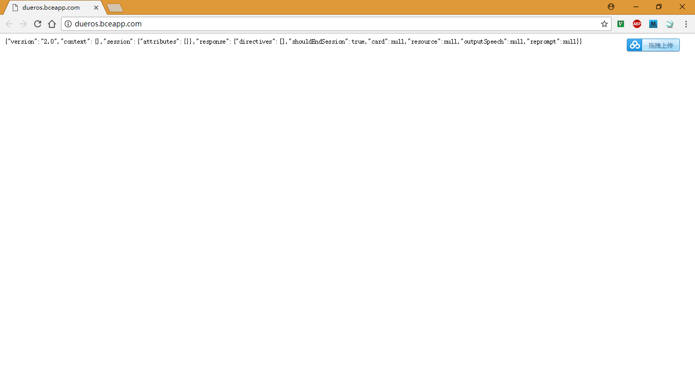
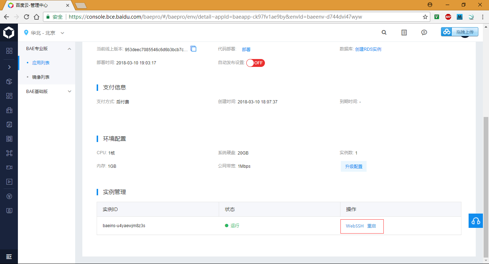
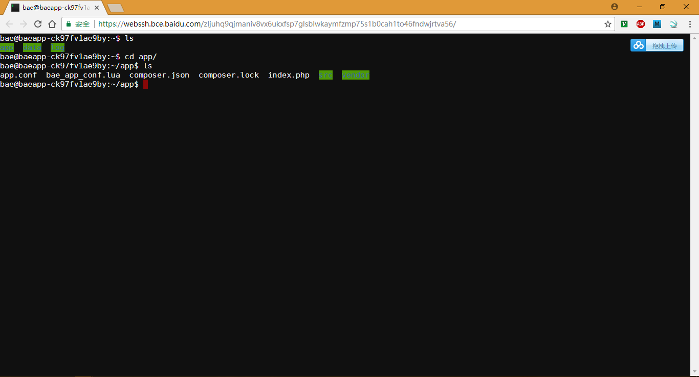

# DuerOS BAE base-sample

base-sample基本上算是dueros/bot-sdk仓库的一个打包，默认从刚刚建立的BAE服务器上获取的git仓库是没有关系的，所以需要替换掉默认git仓库中的所有文件才行；

## base-sample使用大体流程

* `apt-get install composer curl jq`
* `mkdir ~/bae && cd ~/bae` 
* `git init`
* `git pull https://git.bce.baidu.com/baeapp-ck97fv1ae9by.git master`
* `composer require dueros/bot-sdk`
* `cd vendor/dueros/bot-sdk/samples/` 
* `tar xvf bae-sample.tgz`
* 拷贝bae-sample根目录的文件和src目录下的文件到`~/bae`目录
* 修改`~/bae/src/Bot.php`
* `composer dump-autoload`
* 部署：
  ```
  root@localhost:~/zengjf/bae# git push https://git.bce.baidu.com/baeapp-ck97fv1ae9by.git master
  Username for 'https://git.bce.baidu.com': 5c5b5ea289ed4c6db75c131e7eaf5715
  Password for 'https://5c5b5ea289ed4c6db75c131e7eaf5715@git.bce.baidu.com': 
  Counting objects: 226, done.
  Compressing objects: 100% (213/213), done.
  Writing objects: 100% (226/226), 529.08 KiB | 0 bytes/s, done.
  Total 226 (delta 105), reused 0 (delta 0)
  To https://git.bce.baidu.com/baeapp-ck97fv1ae9by.git
     2ca736f..953deec  master -> master
  root@localhost:~/zengjf/bae# 
  ```

## base-sample Deploy



## HTTP访问



## Web SSH访问




