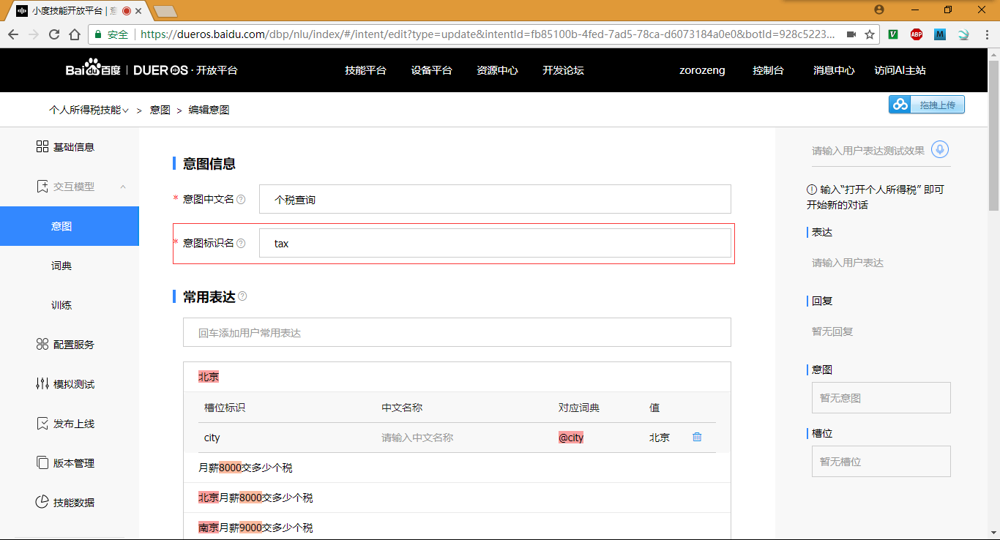
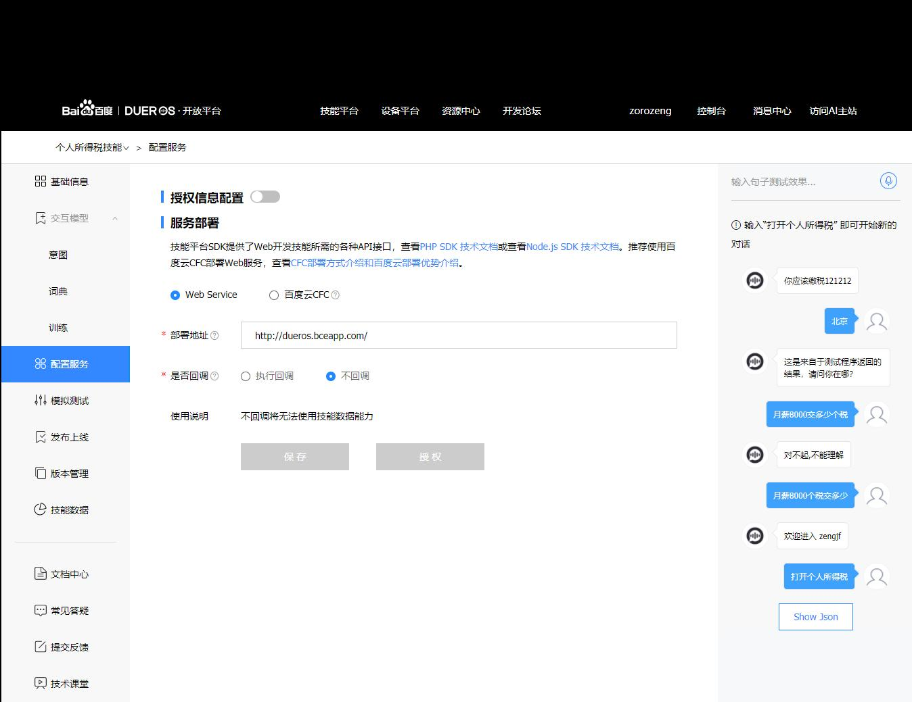

# DuerOS BAE base-sample Access

* [SDK常用功能介绍](https://dueros.baidu.com/didp/doc/dueros-bot-platform/dbp-sdk/Common_Functions_php_markdown)

最主要的是理解下面这一段的意思：  
```
$this->addIntentHandler('tax', function(){
...
})
```
这里的`tax`是指你意图的名字：  


## base-sample 修改之后内容如下

```
bae@baeapp-ck97fv1ae9by:~/app/src$ pwd
/home/bae/app/src
bae@baeapp-ck97fv1ae9by:~/app/src$ cat Bot.php 
<?php
/**
 * @desc 
 **/

namespace Bot;
use \Baidu\Duer\Botsdk\Card\TextCard;
use \Baidu\Duer\Botsdk\Directive\AudioPlayer\Play;

class Bot extends \Baidu\Duer\Botsdk\Bot{
    /**
     * @param null
     * @return null
     **/
    public function __construct($postData = []) {
        parent::__construct($postData);

        $this->addHandler('LaunchRequest', function(){
            $this->waitAnswer();
            $card = new TextCard('欢迎进入 zengjf');
            return [
                    'card' => $card,
                                        //'outputSpeech' => '<speak>欢迎光临</speak>' 
                                        'outputSpeech' => '欢迎进入 zengjf',
                                ];

        });


        $this->addIntentHandler('tax', function(){
            if($this->request->isDialogStateCompleted()) {
                $card = new TextCard('你应该缴税121212');
                $this->endDialog();
                // $directive = new Play('http://other.web.rh01.sycdn.kuwo.cn/f2e1e2e47647e9644a1a736804ac1338/59de0d2c/resource/n2/9/66/3331052726.mp3'); 
                return [
                    // 'directives' => [$directive],
                    'card' => $card,
                    'outputSpeech' => '你应该缴税121212',
                ];
            }

            if(!$this->getSlot('city')) {
                $card = new TextCard('这是来自于测试程序返回的结果，请问你在哪？');
                $this->nlu->ask('city');
                return [
                    'card' => $card,
                                        'reprompt' => '这是来自于测试程序返回的结果，请问你在哪？',
                                        'outputSpeech' => '这是来自于测试程序返回的结果，请问你在哪？',
                                ];
            }else{
                $this->nlu && $this->nlu->setDelegate();
            }
        });
    }
}
bae@baeapp-ck97fv1ae9by:~/app/src$ 
```

## 测试结果


