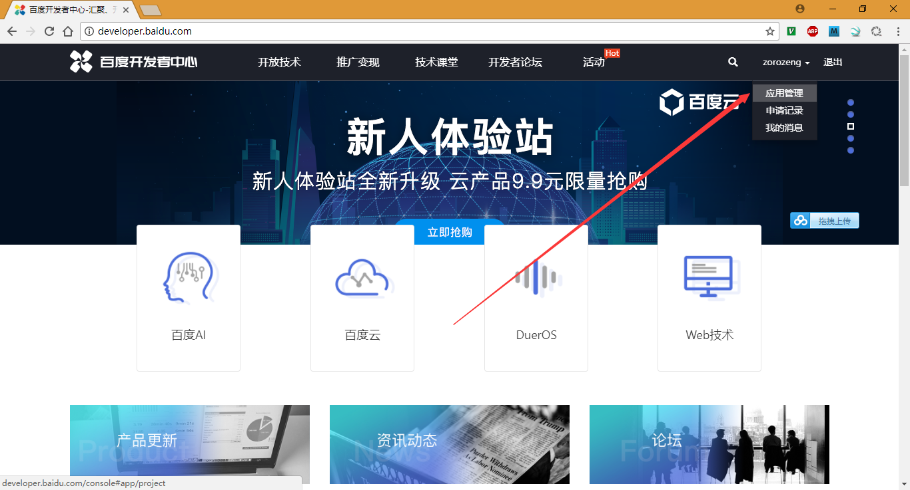
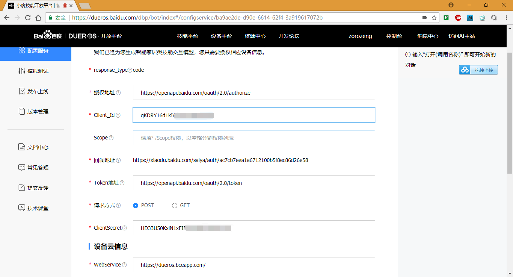
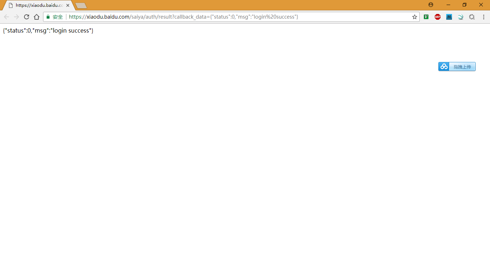

# DuerOS BAE Oauth

## Refers：

* [Oauth授权](http://bit.baidu.com/Course/detail/id/211.html)
* [百度OAuth](http://developer.baidu.com/wiki/index.php?title=docs/oauth)

## BAE Pro Web服务器

这部分请看前面的文档，部署的内容，请参考：  
https://github.com/dueros/bot-sdk/tree/master/samples/thirdparty_nlu_self

## 获取百度的Oauth 2.0服务

* 访问：http://developer.baidu.com/
* 打开应用管理界面：  
  
* 在里面创建一组Key就行了；
* 在《安全设置》里面设置《授权回调页》，里面的内容请参考：[Oauth授权](http://bit.baidu.com/Course/detail/id/211.html)

## 设置Oauth

