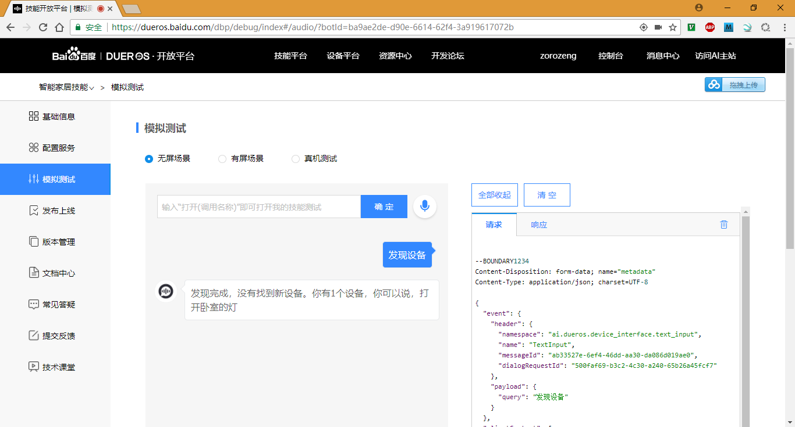

# DuerOS BAE SmartHome Demo

## 参考文档

* [发现设备](https://dueros.baidu.com/didp/doc/dueros-bot-platform/dbp-smart-home/protocol/discovery-message_markdown)

## Source Code

```PHP
bae@baeapp-czi2hek5x6p6:~/app$ cat index.php 
<?php
    function logFile($type, $msg) {
        $myfile = fopen("./log/".date("Ymd").".txt", "a+");
        fwrite($myfile, $type."(".date("Ymd His").") : ".$msg."\r\n");
        fclose($myfile);
    }

    function postLog($msg) {
        logFile("require", $msg);
    }

    function responseLog($msg) {
        logFile("response", $msg);
    }

    $post_raw = file_get_contents("php://input");
    $post_json = json_decode($post_raw, true);

    postLog($post_raw);

    $responseStr = " {
        \"header\": {
            \"namespace\": \"DuerOS.ConnectedHome.Discovery\",
            \"name\": \"DiscoverAppliancesResponse\",
            \"messageId\": \"".trim(shell_exec("cat /proc/sys/kernel/random/uuid"))."\",
            \"payloadVersion\": \"1\"
        },
        \"payload\": {
            \"discoveredAppliances\": [{
                \"actions\": [
                    \"turnOn\",
                    \"turnOff\",
                    \"incrementBrightnessPercentage\",
                    \"decrementBrightnessPercentage\"
                ],
                \"applianceTypes\": [
                    \"LIGHT\"
                ],
                \"additionalApplianceDetails\": {
                    \"extraDetail1\": \"optionalDetailForSkillAdapterToReferenceThisDevice\",
                    \"extraDetail2\": \"There can be multiple entries\",
                    \"extraDetail3\": \"but they should only be used for reference purposes.\",
                    \"extraDetail4\": \"This is not a suitable place to maintain current device state\"
                },
                \"applianceId\": \"uniqueLightDeviceId\",
                \"friendlyDescription\": \"展现给用户的详细介绍\",
                \"friendlyName\": \"卧室的灯\",
                \"isReachable\": true,
                \"manufacturerName\": \"设备制造商的名称\",
                \"modelName\": \"fancyLight\",
                \"version\": \"your software version number here.\"
            }]
        }
    }
    ";

    responseLog($responseStr);

    header("Content-Type: application/json");

    // echo json_encode(json_decode($responseStr, true)); 
    echo $responseStr; 
?>
```

## 测试效果


