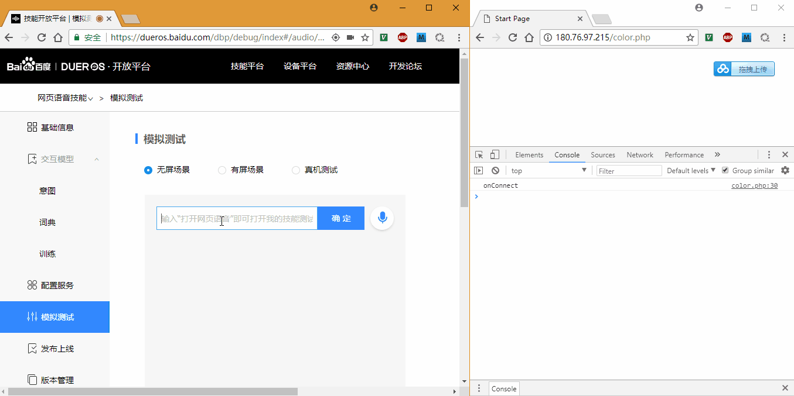

# DuerOS IoTHub WebColor

## PHP代码Branch

https://github.com/ZengjfOS/DuerOS/tree/WebColor

## Show Demo



## color.php source code

```HTML
<!DOCTYPE html>
<html>
  <head>
    <title>Start Page</title>
    <meta http-equiv="Content-Type" content="text/html; charset=UTF-8">
    <script src="https://cdnjs.cloudflare.com/ajax/libs/paho-mqtt/1.0.1/mqttws31.min.js" type="text/javascript"></script>
  </head>
  <body id="body_color">

    <!-- 
        Eclipse Paho JavaScript Client 
            https://www.eclipse.org/paho/clients/js/
    -->
 
    <script>

        function makeid(length) {
          var text = "";
          var possible = "ABCDEFGHIJKLMNOPQRSTUVWXYZabcdefghijklmnopqrstuvwxyz0123456789";
        
          for (var i = 0; i < length; i++)
            text += possible.charAt(Math.floor(Math.random() * possible.length));
        
          return text;
        }

        // Create a client instance
        var client = new Paho.MQTT.Client("zengjf.mqtt.iot.gz.baidubce.com", 8884, "DeviceId-" + makeid(6));
        
        // set callback handlers
        client.onConnectionLost = onConnectionLost;
        client.onMessageArrived = onMessageArrived;
        
        // connect the client
        client.connect({onSuccess:onConnect, onFailure:onConnectError, userName:"zengjf/sz_monitor_room", password:"QE0BHFvFnIkBRIaJtPYzo3m/63Esv5fzzMr9tYVOsHo=", useSSL:true});
        
        
        // called when the client connects
        function onConnect() {
          // Once a connection has been made, make a subscription and send a message.
          console.log("onConnect");
          client.subscribe("test-iot-sub");
        }

        // called when the client connects
        function onConnectError() {
          // Once a connection has been made, make a subscription and send a message.
          console.log("onConnectError");
        }
        
        // called when the client loses its connection
        function onConnectionLost(responseObject) {
          if (responseObject.errorCode !== 0) {
            console.log("onConnectionLost:"+responseObject.errorMessage);
          }
        }
        
        // called when a message arrives
        function onMessageArrived(message) {
          console.log("onMessageArrived:"+message.payloadString);
          json_data = JSON.parse(message.payloadString);

          seven_color_en = ["red", "green", "blue", "yellow", "black", "white", "purple"];
          seven_color_zh = ["红色", "绿色", "蓝色", "黄色", "黑色", "白色", "紫色"];

          for (var index = 0; index < seven_color_zh.length; index++) {
            console.log(seven_color_zh[index]);
            if (seven_color_zh[index] == json_data["color"]) {
              document.getElementById("body_color").style.background = seven_color_en[index];
              break;
            }
          }
        }
 
        console.log("MQTT Client Set Over, Wait Data Tranfer.")
    </script>
  </body>
</html>
```

## Bot source code

* index.php
  ```PHP
  <?php
  ini_set('display_errors', 1);
  error_reporting(~0);
  require 'vendor/autoload.php';
  require 'Bot.php';
  
  use \Bot\Bot;
  
  $tax = new Bot();
  
  header("Content-Type: application/json");
  $ret = $tax->run();
  
  print $ret;
  ?>
  ```
* Bot.php
  ```PHP
  <?php
  /**
   * @desc 
   **/
  
  namespace Bot;
  use \Baidu\Duer\Botsdk\Card\TextCard;
  use \Baidu\Duer\Botsdk\Directive\AudioPlayer\Play;
  use \LibMQTT\Client;
  
  class Bot extends \Baidu\Duer\Botsdk\Bot{
      /**
       * @param null
       * @return null
       **/
      public function __construct($postData = []) {
          parent::__construct($postData);
  
          $this->addHandler('LaunchRequest', function(){
              $this->waitAnswer();
              $card = new TextCard('Welcome To WebColor.');
              return [
                  'card' => $card,
                  'outputSpeech' => 'Welcome To WebColor.',
              ];
  
          });
  
          $this->addIntentHandler('displayColor', function(){
              if($this->request->isDialogStateCompleted()) {
  
                  $server="zengjf.mqtt.iot.gz.baidubce.com";                   // change if necessary
                  $port = 1883;                                                // change if necessary
                  $username = "zengjf/sz_monitor_room";                        // set your username
                  $password = "QE0BHFvFnIkBRIaJtPYzo3m/63Esv5fzzMr9tYVOsHo=";  // set your password
                  $client_id = "DeviceId".$this->generateRandomString(6);                                  // make sure this is unique for connecting to sever - you could use uniqid()
                  $mqtt = new Client($server, $port, $client_id);
                  $mqtt->setAuthDetails($username, $password);
                  $result = $mqtt->connect(true);
                  if ($result) {
                      $mqtt->publish("test-iot-sub", $this->getSlot('color'), 0);
                      $mqtt->close();
                  }
  
                  $card = new TextCard('OK');
                  $this->endDialog();
  
                  return [
                      'card' => $card,
                      'outputSpeech' => 'OK',
                  ];
              }
  
              if(!$this->getSlot('color')) {
                  $card = new TextCard('which color are you want?');
                  $this->nlu->ask('color');
                  return [
                      'card' => $card,
                      'reprompt' => 'which color are you want?',
                      'outputSpeech' => 'which color are you want?',
                  ];
              }else{
                  $this->nlu && $this->nlu->setDelegate();
              }
          });
      }
  
      function generateRandomString($length = 10) {
          $characters = '0123456789abcdefghijklmnopqrstuvwxyzABCDEFGHIJKLMNOPQRSTUVWXYZ';
          $charactersLength = strlen($characters);
          $randomString = '';
          for ($i = 0; $i < $length; $i++) {
              $randomString .= $characters[rand(0, $charactersLength - 1)];
          }
          return $randomString;
      }
  }
  ```
