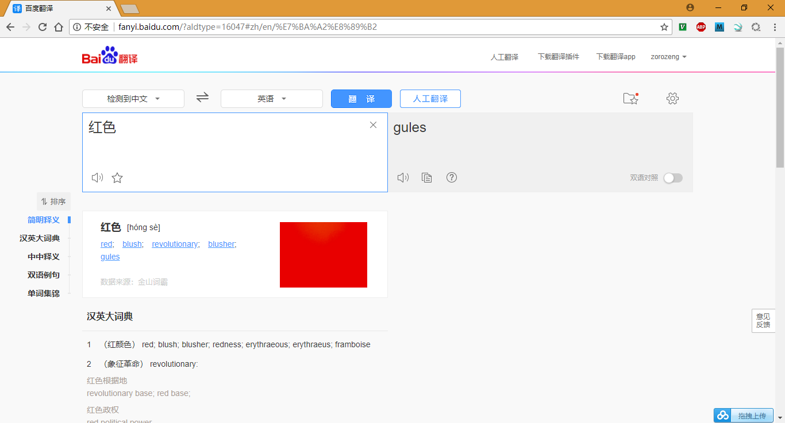

# DuerOS Translate

用了一下百度翻译绝望了，直接放弃，换成Google翻译，发现BAE PRO安装的PHP版本低了，之前一直用PHP 5.4版本进行测试、分析，但是目前Google翻译的库要使用PHP 5.5以上版本；

## 百度翻译跟我讲了一个笑话



## Google翻译

* [Stichoza/google-translate-php](https://github.com/Stichoza/google-translate-php)
* **PHP版本大于等于5.5**；
* 安装：`composer require stichoza/google-translate-php`
* 翻译测试： 
  ```PHP
  <?php
  ini_set('display_errors', 1);
  error_reporting(~0);
  require 'vendor/autoload.php';
  
  use \Stichoza\GoogleTranslate\TranslateClient;
  
  $tr = new TranslateClient(); // Default is from 'auto' to 'en'
  $tr->setSource('en'); // Translate from English
  $tr->setTarget('zh-CN'); // Translate to Chinese
  $tr->setUrlBase('http://translate.google.cn/translate_a/single');
  
  $translate_data =  $tr->translate('red');
  echo $translate_data."\r\n";
  
  $tr->setSource('zh-CN'); // Translate from Chinese
  $tr->setTarget('en'); // Translate to English
  $translate_data =  $tr->translate("红色");
  echo $translate_data."\r\n";
  ?>
  ```
* 测试结果：
  ```Shell
  bae@baeapp-63kpfvrxjy2q:~/app$ php translate.php 
  红
  red
  bae@baeapp-63kpfvrxjy2q:~/app$ 
  ```
