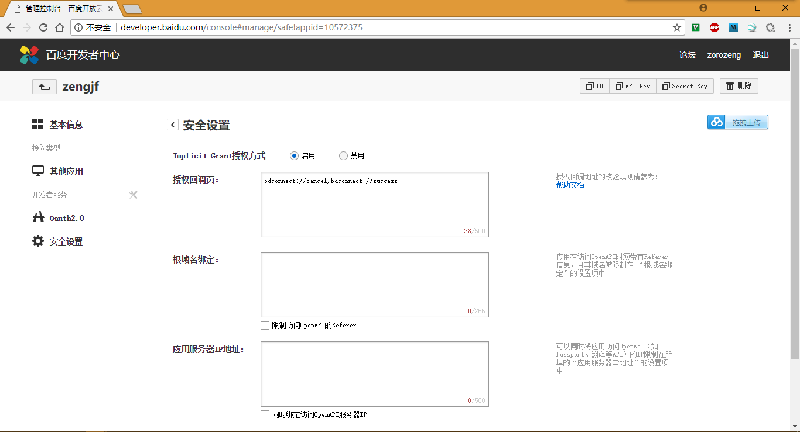
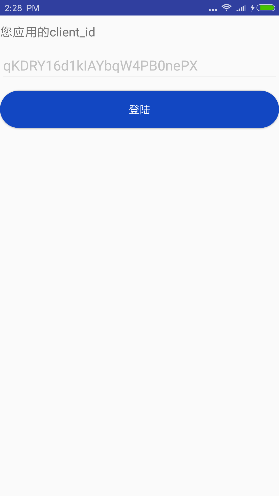
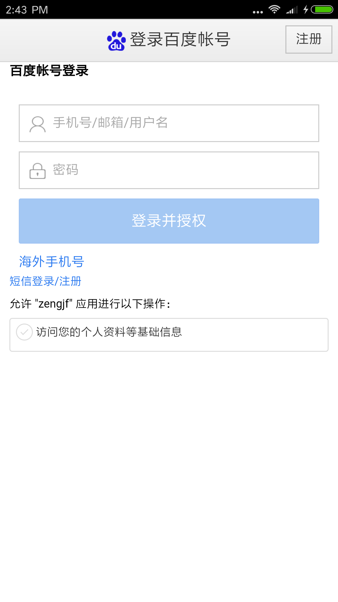
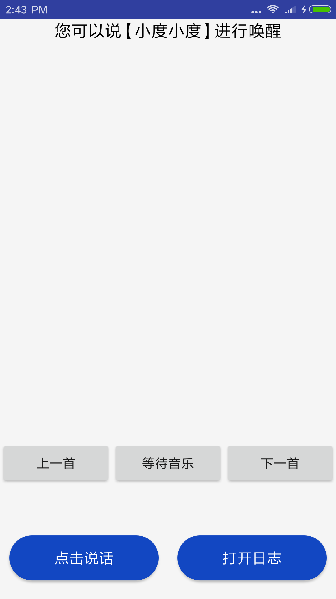

# DcsSampleOAuthActivity

## Oauth2.0

* 百度开发者中心：http://developer.baidu.com/
* [dureos登录返回redirect_uri_mismatch错误，怎么改](https://dueros.baidu.com/forum/topic/show/244063)
  * 在开发者平台控制台，点击左侧"安全设置"；
  * 在"授权回调页"输入框中输入"bdconnect://cancel,bdconnect://success"（不带双引号）；



## App操作流程

|Start App|Baidu Username/Passwd|Login|
|:---:|:---:|:---:|
||||

## AndroidManifest.xml

```
<manifest xmlns:android="http://schemas.android.com/apk/res/android"
    package="com.baidu.duer.dcs">
    [...省略]

    <application
        [...省略]
        <activity
            android:name="com.baidu.duer.dcs.androidapp.DcsSampleOAuthActivity"
            android:label="@string/app_name"
            android:screenOrientation="portrait"
            android:theme="@style/AppTheme.NoActionBar">
            <intent-filter>
                <action android:name="android.intent.action.MAIN" />

                <category android:name="android.intent.category.LAUNCHER" />
            </intent-filter>
        </activity>
        [...省略]
    </application>

    [...省略]
</manifest>
```

## 代码分析

* 设置API Key：`private static final String CLIENT_ID = "YaWHwD3tcgfMSlyNXYWnrkGWgSq3raMo"`;
* 百度的oauth.api会自动获取想信息；
* 跳转到DcsSampleMainActivity中：
  ```
  private void startMainActivity() {
      Intent intent = new Intent(DcsSampleOAuthActivity.this, DcsSampleMainActivity.class);
      startActivity(intent);
      finish();
  }
  ```
