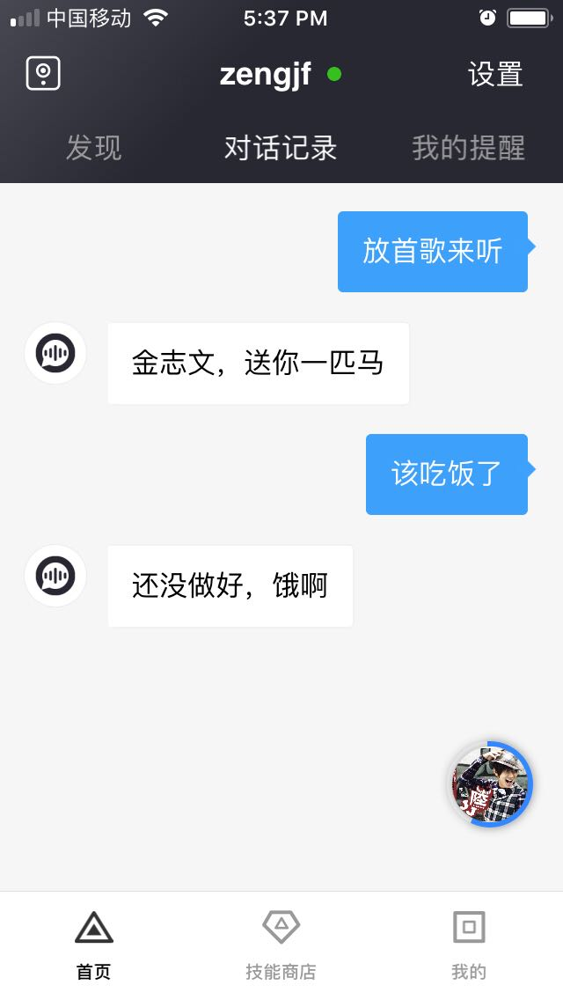

# DuerOS Personal DevKit

## 参考文档

* [DuerOS智能硬件开发套件产品介绍](https://dueros.baidu.com/didp/doc/device-devkit/intro_markdown)
* [DuerOS开发套件个人版使用文档](http://dueros.bj.bcebos.com/DevkitPersonalImg/DuerOS%E5%BC%80%E5%8F%91%E5%A5%97%E4%BB%B6%E4%B8%AA%E4%BA%BA%E7%89%88%E4%BD%BF%E7%94%A8%E6%96%87%E6%A1%A3.rar?authorization=bce-auth-v1%2Fa4d81bbd930c41e6857b989362415714%2F2017-09-05T11%3A56%3A56Z%2F-1%2Fhost%2Fc185bd3c0f04a58b77737635705755b5730b6f83a57e6bf00a7ecd587bc7c78d)
* [DuerOS开发套件个人版镜像软件](http://dueros.bj.bcebos.com/DevkitPersonalImg%2FDuerOS_For_Raspberry_v0.8.1_20171221.img.gz?authorization=bce-auth-v1%2Ff04711cb669b4f6f9c57cbe33dbcd609%2F2017-12-21T08%3A58%3A38Z%2F-1%2Fhost%2Fd263e7ba66ef6213d75cb02f5e400aa6ac7e029d5409bd16f31d353b37df2d82)

## 连接图


## 基本操作：

度秘服务具有上电自启动功能，可以通过以下命令控制度秘服务：

* 使能开机自启动：`sudo systemctl enable duer`
* 取消开机自启动：`sudo systemctl disable duer`
* 启动度秘服务：`sudo systemctl start duer`
* 停止度秘服务：`sudo systemctl stop duer`

```
pi@raspberrypi:~ $ sudo systemctl enable duer
pi@raspberrypi:~ $ sudo systemctl disable duer
Removed symlink /etc/systemd/system/multi-user.target.wants/duer.service.
pi@raspberrypi:~ $ sudo systemctl start duer
pi@raspberrypi:~ $ sudo systemctl stop duer
```

## 无法连接网络的问题

由于我自己刚开始就直接连接了WiFi，导致后面使用小度之家无法连接WiFi：
* [关于树莓派配网失败，登入失败，重新配网等联网问题,可以尝试用小度之家重新配网解决](https://dueros.baidu.com/forum/topic/show/248584?pageNo=1)

```
pi@raspberrypi:/etc/wpa_supplicant $ pwd
/etc/wpa_supplicant
pi@raspberrypi:/etc/wpa_supplicant $ cp wpa_supplicant.conf.bk wpa_supplicant.conf
pi@raspberrypi:/etc/wpa_supplicant $ 
```

这样重启设备，然后用百度直接设置好WiFi，然后连接到树莓派的DuerOS开头无密码的WiFi，之后就能正常访问网络了。


