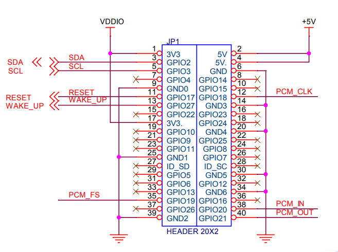
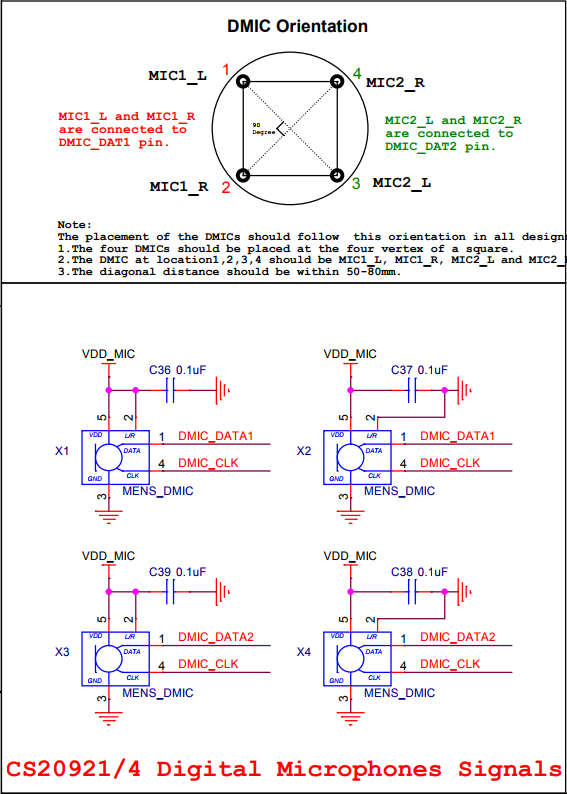
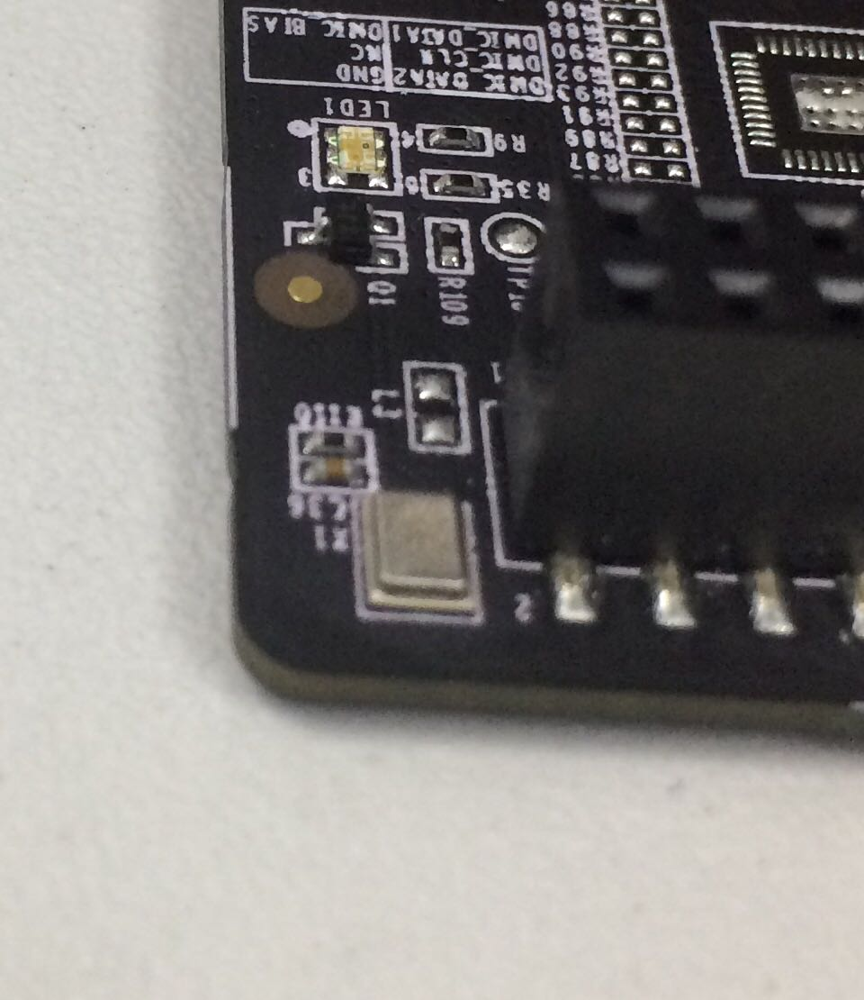

# DuerOS Personal DevKit Schematic

## 参考文档

* [原理图](./refers/DuerOS_Personal_DevKit_Schematic_v1.0.pdf)

## 40P信号接头

## 微机电数字咪头

拿到板子的时候以为只能戴耳机，用了之后发现没有耳机上的麦也是OK的，一顿惊讶，看了原理图之后才知道用了这东西，当时内心里很惊讶。

  

